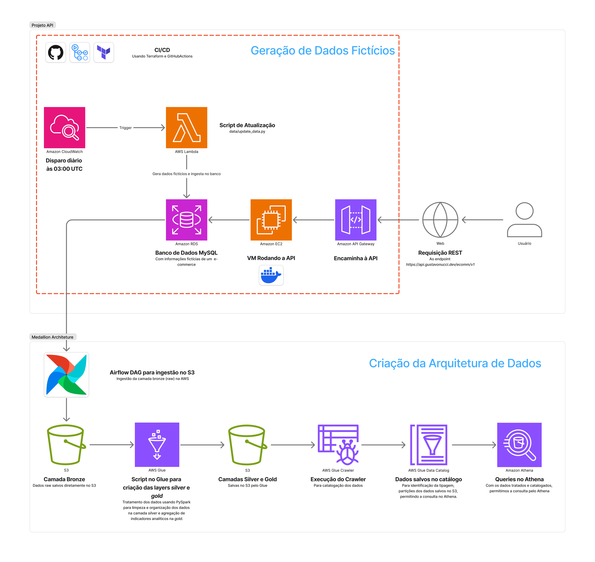

# 📊 E-commerce Analysis - Data Warehouse AWS

## 📋 Descrição
Pipeline completo de análise de dados para e-commerce com arquitetura Medallion (Bronze, Silver, Gold) na AWS. O projeto implementa um data warehouse moderno utilizando Airflow para orquestração, Glue para transformações, S3 para armazenamento e Athena para consultas, oferecendo uma solução escalável para análise de dados de e-commerce.

**🎯 Objetivo do Projeto**: Construir uma pipeline de dados robusta e escalável que ingere dados da [Fake E-commerce API](https://api.gustavonucci.dev/ecomm/v1), processa através da arquitetura Medallion e disponibiliza dados analíticos para dashboards, relatórios e APIs de consulta, demonstrando práticas modernas de Data Engineering na AWS.



## ⚡ Funcionalidades

### 🏗️ Infraestrutura como Código
Infraestrutura AWS completa provisionada via Terraform, incluindo VPC, EC2 para Airflow, S3 Data Lake, Glue Catalog, IAM roles e todos os recursos necessários para execução da pipeline de dados.

*📖 Documentação detalhada: [terraform/README.md](terraform/README.md)*

### 🔄 Pipeline de Dados (Medallion Architecture)
Pipeline automatizada com Airflow que implementa a arquitetura Medallion com três camadas de dados: Bronze (dados brutos), Silver (dados limpos) e Gold (dados agregados), garantindo qualidade e governança dos dados.

*📖 Documentação detalhada: [airflow/README.md](airflow/README.md)*

### 🛠️ Transformações de Dados
Scripts Glue desenvolvidos em PySpark para transformação e limpeza dos dados, incluindo deduplicação, validação, padronização de formatos e criação de métricas de negócio.

*📖 Documentação detalhada: [terraform/scripts/README.md](terraform/scripts/README.md)*

### 📈 Análise de Dados
Dados estruturados e otimizados para análise via Athena, com possibilidade de integração com ferramentas de BI como QuickSight, Power BI e Metabase para criação de dashboards e relatórios.

*📖 Documentação detalhada: [docs/Análise Fonte de Dados.md](docs/Análise%20Fonte%20de%20Dados.md)*

## 🚀 Tecnologias Utilizadas

### 🐍 Orquestração & Pipeline
- **Apache Airflow** - Orquestração de workflows de dados
- **Python 3.9+** - Scripts de extração e transformação

### ☁️ Infraestrutura AWS
- **EC2** - Servidor Airflow (t3.medium)
- **S3** - Data Lake com arquitetura Medallion
- **Glue** - Catálogo de dados e jobs de transformação
- **Athena** - Engine de consultas SQL
- **IAM** - Controle de acesso e segurança

### 🔄 Processamento & Transformação
- **AWS Glue Jobs** - Transformações PySpark
- **Apache Spark** - Processamento distribuído
- **Parquet** - Formato otimizado para analytics

### 🛠️ DevOps & Automação
- **Terraform** - Infraestrutura como código
- **Git/GitHub** - Controle de versão
- **CloudWatch** - Monitoramento e logs

## 📁 Estrutura do Projeto

```
ecommerce-analisys/
├── README.md                    # Documentação principal do projeto
├── pyproject.toml              # Configurações Python e dependências
├── airflow/                    # Pipeline de dados e orquestração
│   ├── README.md              # Documentação do Airflow
│   └── dags/
│       └── ecommerce_ingestion.py  # DAG principal de ingestão
├── terraform/                  # Infraestrutura como código
│   ├── README.md              # Documentação da infraestrutura
│   ├── main.tf                # Configuração principal
│   ├── variables.tf           # Variáveis de entrada
│   ├── outputs.tf             # Outputs da infraestrutura
│   ├── network.tf             # VPC, subnets, gateways
│   ├── ec2.tf                 # Instância EC2 para Airflow
│   ├── s3.tf                  # Buckets S3 para Data Lake
│   ├── glue.tf                # Glue Catalog e Jobs
│   ├── iam.tf                 # Roles e políticas IAM
│   ├── sgs.tf                 # Security Groups
│   └── scripts/               # Scripts Glue para transformações
│       ├── README.md          # Documentação dos scripts
│       ├── bronze_to_silver.py    # Transformação Bronze → Silver
│       └── silver_to_gold.py      # Transformação Silver → Gold
└── docs/                      # Documentação e análises
    ├── Análise Fonte de Dados.md  # Análise da API fonte
    └── architecture-diagram.png   # Diagrama da arquitetura
```

## 🏛️ Arquitetura Medallion

### 🥉 BRONZE - Dados Brutos
- Dados extraídos diretamente da API de e-commerce
- Formato: Parquet particionado por data
- Localização: `s3://datalake/bronze/tabela/ano=2025/mes=01/dia=15/`
- Processamento: Ingestão via Airflow com mínima transformação

### 🥈 SILVER - Dados Limpos
- Dados padronizados, deduplicados e validados
- Conversão de tipos, normalização de formatos
- Catálogo no AWS Glue para descoberta de dados
- Processamento: Jobs Glue com PySpark

### 🥇 GOLD - Dados Analíticos
- Métricas de negócio, KPIs e agregações
- Joins resolvidos, dados desnormalizados para performance
- Otimizado para consultas analíticas
- Consumo: Athena, QuickSight, APIs de consulta

## 🔄 Fluxo de Dados

```text
[ Fake E-commerce API ]
       │
       ▼
[ Airflow DAG - Ingestão ]
       │
       ▼
─────  BRONZE (S3)  ───────────────────────────
- Dados brutos da API (JSON → Parquet)
- Particionado por data de extração
- Preserva estrutura original dos dados
       │
       ▼
[ Glue Job - bronze_to_silver.py ]
       │
       ▼
─────  SILVER (S3)  ───────────────────────────
- Dados limpos e padronizados
- Deduplicação e validação de qualidade
- Catálogo Glue para metadata
       │
       ▼
[ Glue Job - silver_to_gold.py ]
       │
       ▼
─────  GOLD (S3)  ─────────────────────────────
- Métricas e KPIs de negócio
- Dados otimizados para analytics
- Agregações pré-calculadas
       │
       ├──► [ Athena + QuickSight ] → Dashboards
       ├──► [ Athena + Power BI ] → Relatórios
       └──► [ Lambda + Athena ] → APIs de consulta
```

## 🤝 Contribuição

Contribuições são bem-vindas! Abra uma Issue ou Pull Request para discussão de melhorias, correções ou novas funcionalidades.
